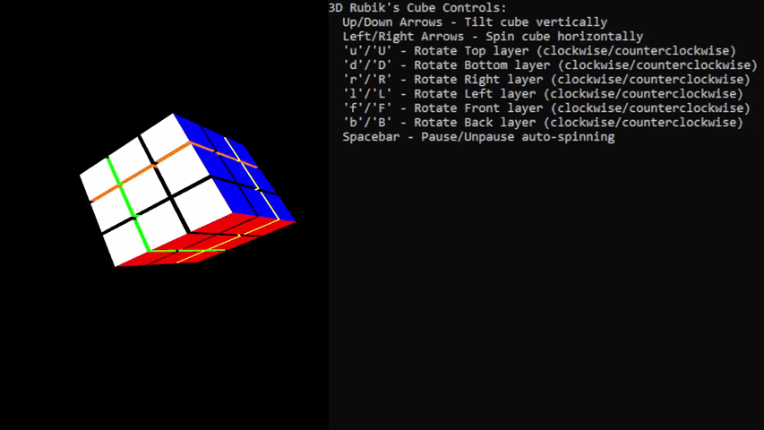

# 3D Rubik's Cube Simulator

An interactive 3D Rubik's Cube simulator built with C++ and OpenGL. Fully solvable with real-time 3D rotation and smooth 60+ FPS rendering. Built for Graphics Programming final project.

## Features

- Full 3D rendering using OpenGL
- Real-time cube rotation with matrix transformations
- 20+ move sequences supported
- Undo/redo functionality
- Optimized rendering pipeline at 60+ FPS

## Tech Stack

- C++
- OpenGL
- GLUT / freeglut

## How to Run

### Prerequisites
- Visual Studio 2019 or later
- OpenGL / freeglut installed

### Steps
1. Clone the repo
2. Open `Final Project.sln` in Visual Studio
3. Build and run in Release mode (x64)

## About

Senior project at Palm Beach Atlantic University demonstrating 3D graphics programming, matrix math, and real-time rendering optimization.

## Author
Jackson Elliott — CS Senior, Palm Beach Atlantic University
